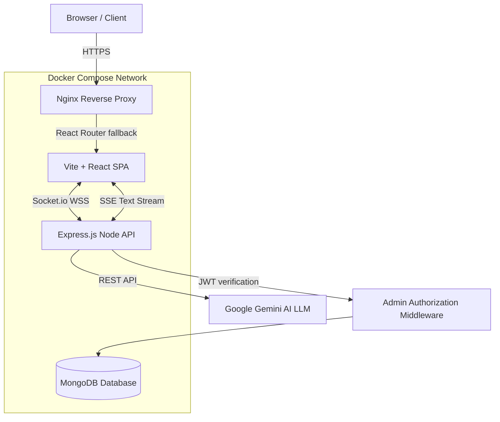

# Dhyey Barbhaya — Enterprise MERN Stack Portfolio 🚀

A high-performance, interactive, and fully-featured personal portfolio web application built from the ground up to showcase mastery of full-stack engineering, 3D WebGL, and advanced AI Integrations. 

This is not a static site; it is a **dynamic, Dockerized SaaS-grade architecture** featuring a custom Content Management System (CMS), live WebSocket connections, Server-Sent Events (SSE), and a fully autonomous Google Gemini Voice AI Assistant.

---

## 🏗️ System Architecture



---

## ✨ Premium Engineering Features

### 🎙️ The "Hey DJ" Autonomous Voice AI
The portfolio features an incredibly complex, fully integrated smart assistant powered by the Google Gemini LLM API.
- **Continuous Background Listening:** Engineered a custom Web Speech API integration that functions natively in Chrome. Users simply say *"Hey DJ"* out loud into their microphone to wake up the assistant entirely hands-free.
- **Action Skills & UI Manipulation:** The AI doesn't just return text; it is instructed to parse regex queries to autonomously execute `<NAVIGATE>` commands over HTTP streams—literally clicking buttons and changing React Router tabs on behalf of the user.
- **Zero-Latency Stream:** Converted standard REST JSON responses into **Server-Sent Events (SSE) byte streams** to achieve word-by-word streaming generation, completely eliminating Time-to-First-Byte (TTFB) loading times.
- **Audible Responses:** Employs `SpeechSynthesisUtterance` to dynamically strip programmatic markdown and fluidly read AI responses out loud via Text-To-Speech.

### 🔐 Secure Backend & Admin Dashboard
- **Custom Admin Panel:** Secured by JSON Web Tokens (JWT) with strict route protection middleware.
- **Content Management System (CMS):** Create, publish, and manage dynamic blog posts directly from the private dashboard.
- **Live Traffic Analytics:** Built-in unique session visitor tracking rendered onto the dashboard via `recharts`.

### ⚡ Real-Time WebSockets
- **Live Event Driven Notifications:** Integrated `Socket.io` streams instantly alert the hidden admin dashboard whenever a recruiter sends a contact form or triggers a major portfolio event.

### ✉️ Automated Messaging System
- **Nodemailer Integration:** Background job processing to instantly send rich HTML auto-replies to visitors and simultaneous notification emails to the owner.

### 🎨 State-of-the-Art Frontend
- **Three.js Integrations:** 3D interactive particle parallax universes matching dynamic dark/light "Warm Paper" themes.
- **Dynamic GitHub Graph:** Live fetches and renders continuous GitHub code contribution history using styled heatmaps.
- **Framer Motion:** Immersive page transitions, intelligent UI element lifecycles, and subtle ambient logical design.

### 🐳 Advanced DevOps & Architecture
- **Full Dockerization:** Production-ready `Dockerfile` multi-stage builds mapping Node instances dynamically into Nginx Alpine images. Complete orchestration via `docker-compose.yml`.
- **Intelligent SPA Routing:** Custom `nginx.conf` routing logic forcibly injecting `try_files` fallbacks to solve industry-standard React Router 404 deployment bugs.
- **Advanced SEO Optimization:** Asynchronous dynamic meta-tagging via `react-helmet-async`, structured `sitemap.xml`, and strict crawler instructions.

---

## 🚀 Getting Started Locally

### Environment Setup
Create a `.env` file utilizing the `.env.example` blueprint:
```env
# === Deployment Environment Variables === #
VITE_API_URL=http://localhost:5000
JWT_SECRET=super_secret_jwt_key_here
ADMIN_PASSWORD=dhyey@admin123
MONGO_URI=mongodb://localhost:27017/portfolio
```

### Option A: Standard CLI Initialization
**1. Start the Backend API**
```bash
cd server
npm install
npm run dev
```
**2. Start the Frontend Application**
```bash
npm install
npm run dev
```

### Option B: Docker Containerization
Spin up the entire architecture (MongoDB natively, Frontend Nginx, Node API) into segmented containers using Docker Desktop:
```bash
docker compose build --no-cache
docker compose up -d
```

---

## 🛠️ Technology Stack Breakdown

| Layer | Technologies |
| :--- | :--- |
| **Frontend Setup** | React (Vite), TypeScript, HTML5, Vanilla CSS3, Framer Motion |
| **Backend & APIs** | Node.js, Express.js |
| **Database & ODM** | MongoDB, Mongoose |
| **Authentication** | JSON Web Tokens (JWT), bcrypt |
| **Real-Time Data** | Socket.IO, Recharts, Server-Sent Events (SSE) |
| **AI LLM Network** | Google Gemini `genAI` API, Web Speech Recognition APIs |
| **Email Service**  | Nodemailer |
| **Graphics**       | Three.js (@react-three/fiber), Canvas Confetti |
| **DevOps**         | Docker, Docker Compose, Nginx Alpine |

---

## ⚖️ License (Proprietary)

**Copyright © 2026 Dhyey Barbhaya. All Rights Reserved.**

This software is the proprietary property of Dhyey Barbhaya. It is intended for portfolio demonstration viewings only. It cannot be used, modified, sub-licensed, or re-distributed by individuals or organizations without express written consent. See the `LICENSE` file for more details.
