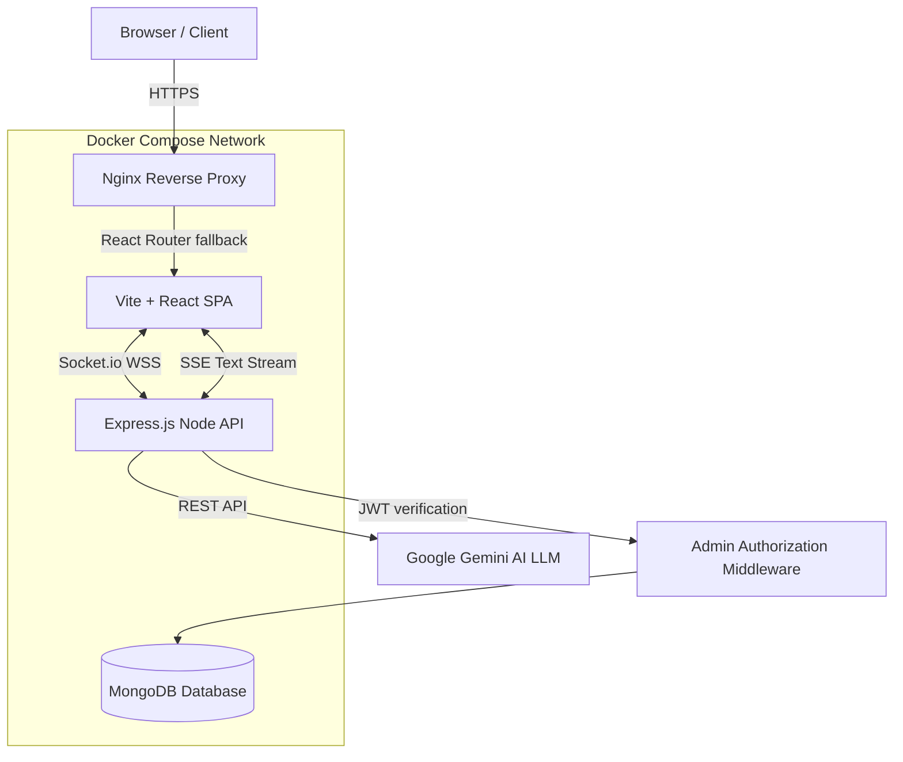

# Dhyey Barbhaya — Enterprise MERN Stack Portfolio 🚀

A high-performance, interactive, and fully-featured personal portfolio web application built from the ground up to showcase mastery of full-stack engineering, 3D WebGL, and advanced AI Integrations. 

This is not a static site; it is a **dynamic, Dockerized SaaS-grade architecture** featuring a custom Content Management System (CMS), live WebSocket connections, Server-Sent Events (SSE), a fully autonomous Google Gemini Voice AI Assistant, and a hidden **physics-driven game engine** that lets users destroy the live UI.

---

## 🏗️ System Architecture



---

## ✨ Premium Engineering Features

### 🎮 Destruction Protocol — WASD Twin-Stick Shooter Easter Egg
A hidden, full-featured **HTML5 Canvas physics engine** disguised inside the portfolio. Activated via the Command Palette, it transforms the live website into a playable arcade game.

- **Twin-Stick Controls:** WASD keyboard movement with independent mouse-aim rotation (`Math.atan2` trigonometry). The player controls a geometric neon spaceship that flies freely across the screen with friction-based acceleration physics.
- **DOM-Scraping Engine:** The Canvas engine uses `querySelectorAll` to scrape 15+ CSS selectors (`.navbar`, `.sidebar`, `.project-item`, `.timeline-item`, `.contact-item`, `.input-wrapper`, etc.) and maps their `getBoundingClientRect()` coordinates into destructible game blocks with randomized cyberpunk neon colors.
- **Hostile AI Turret System:** Surviving UI components act as autonomous turrets — they calculate the player's real-time `(x, y)` vector position and fire targeted red plasma lasers back at the ship. Getting hit triggers a **CRITICAL FAILURE** game-over state.
- **Spawn Invincibility Shield:** A 120-frame (2-second) protection timer with a visual blinking effect prevents instant death on launch.
- **Particle Explosion Physics:** Destroying a DOM component spawns 30 mathematically randomized neon shrapnel particles with velocity decay and alpha fade-out.
- **Rate-Limited Weapons:** A 150ms cooldown prevents infinite laser spam — players must aim strategically.
- **Win/Lose States:** Destroying all visible components triggers **"SYSTEM ANNIHILATED"** (green). Getting hit by enemy fire triggers **"CRITICAL FAILURE"** (red). Both states cleanly restore the original UI.

### ⌨️ Global Command Palette (`Ctrl + K`)
A macOS Spotlight-inspired command interface with glassmorphism design, accessible from anywhere in the app.

- **Fuzzy Keyboard Navigation:** Real-time filtering of commands as users type.
- **System Commands:** Navigate pages, toggle themes (Dark/Light/Cyberpunk), download CV, and trigger the Destruction Protocol.
- **Escape to Dismiss:** Full keyboard-first UX with `Escape` key support.

### 🃏 Physics-Based Staggered Card Animations
All portfolio grids and timeline components use **Framer Motion spring physics** for staggered "dealing" entrance animations.

- **Project Cards:** Sequential scale + rotation spring animations mimicking a physical deck of cards being dealt.
- **Resume Timeline:** Each timeline node enters with cascading delay, scale bounce, and subtle rotation using configurable spring `stiffness` and `damping` values.

### 🎙️ The "Hey DJ" Autonomous Voice AI
The portfolio features an incredibly complex, fully integrated smart assistant powered by the Google Gemini LLM API.
- **Continuous Background Listening:** Engineered a custom Web Speech API integration that functions natively in Chrome. Users simply say *"Hey DJ"* out loud into their microphone to wake up the assistant entirely hands-free.
- **Action Skills & UI Manipulation:** The AI doesn't just return text; it is instructed to parse regex queries to autonomously execute `<NAVIGATE>` commands over HTTP streams—literally clicking buttons and changing React Router tabs on behalf of the user.
- **Zero-Latency Stream:** Converted standard REST JSON responses into **Server-Sent Events (SSE) byte streams** to achieve word-by-word streaming generation, completely eliminating Time-to-First-Byte (TTFB) loading times.
- **Audible Responses:** Employs `SpeechSynthesisUtterance` to dynamically strip programmatic markdown and fluidly read AI responses out loud via Text-To-Speech.

### 🔐 Secure Backend & Admin Dashboard
- **Custom Admin Panel:** Secured by JSON Web Tokens (JWT) with strict route protection middleware.
- **Content Management System (CMS):** Create, publish, and manage dynamic blog posts directly from the private dashboard.
- **Live Traffic Analytics:** Built-in unique session visitor tracking rendered onto the dashboard via `recharts`.

### ⚡ Real-Time WebSockets
- **Live Event Driven Notifications:** Integrated `Socket.io` streams instantly alert the hidden admin dashboard whenever a recruiter sends a contact form or triggers a major portfolio event.

### ✉️ Automated Messaging System
- **Nodemailer Integration:** Background job processing to instantly send rich HTML auto-replies to visitors and simultaneous notification emails to the owner.

### 🎨 State-of-the-Art Frontend
- **Three.js Integrations:** 3D interactive particle parallax universes matching dynamic dark/light "Warm Paper" themes.
- **Dynamic GitHub Graph:** Live fetches and renders continuous GitHub code contribution history using styled heatmaps.
- **Framer Motion:** Immersive page transitions, intelligent UI element lifecycles, and subtle ambient logical design.

### 🐳 Advanced DevOps & Architecture
- **Full Dockerization:** Production-ready `Dockerfile` multi-stage builds mapping Node instances dynamically into Nginx Alpine images. Complete orchestration via `docker-compose.yml`.
- **Intelligent SPA Routing:** Custom `nginx.conf` routing logic forcibly injecting `try_files` fallbacks to solve industry-standard React Router 404 deployment bugs.
- **Advanced SEO Optimization:** Asynchronous dynamic meta-tagging via `react-helmet-async`, structured `sitemap.xml`, and strict crawler instructions.

---

## 🚀 Getting Started Locally

### Environment Setup
Create a `.env` file utilizing the `.env.example` blueprint:
```env
# === Deployment Environment Variables === #
VITE_API_URL=http://localhost:5000
JWT_SECRET=super_secret_jwt_key_here
ADMIN_PASSWORD=dhyey@admin123
MONGO_URI=mongodb://localhost:27017/portfolio
GEMINI_API_KEY=your_gemini_api_key_here
```

### Option A: Standard CLI Initialization
**1. Start the Backend API**
```bash
cd server
npm install
npm run dev
```
**2. Start the Frontend Application**
```bash
npm install
npm run dev
```

### Option B: Docker Containerization
Spin up the entire architecture (MongoDB natively, Frontend Nginx, Node API) into segmented containers using Docker Desktop:
```bash
docker compose build --no-cache
docker compose up -d
```

---

## 🎮 Hidden Easter Eggs & Shortcuts

| Shortcut | Action |
| :--- | :--- |
| `Ctrl + K` | Open the Global Command Palette |
| Type `play` in Command Palette | Launch the Destruction Protocol game |
| `Escape` | Close any modal or overlay |
| Say *"Hey DJ"* | Wake the Voice AI Assistant |

---

## 🛠️ Technology Stack Breakdown

| Layer | Technologies |
| :--- | :--- |
| **Frontend Setup** | React (Vite), TypeScript, HTML5, Vanilla CSS3, Framer Motion |
| **Backend & APIs** | Node.js, Express.js |
| **Database & ODM** | MongoDB, Mongoose |
| **Authentication** | JSON Web Tokens (JWT), bcrypt |
| **Real-Time Data** | Socket.IO, Recharts, Server-Sent Events (SSE) |
| **AI LLM Network** | Google Gemini `genAI` API, Web Speech Recognition APIs |
| **Email Service**  | Nodemailer |
| **Graphics**       | Three.js (@react-three/fiber), HTML5 Canvas, Canvas Confetti |
| **Physics Engine** | Custom Canvas 2D (WASD + Mouse Aim Twin-Stick Shooter) |
| **DevOps**         | Docker, Docker Compose, Nginx Alpine |

---

## 📁 Key File Map

| File | Purpose |
| :--- | :--- |
| `src/components/BreakoutGame.tsx` | Canvas physics engine — Twin-Stick Shooter with hostile AI |
| `src/components/CommandPalette.tsx` | `Ctrl+K` global command interface |
| `src/components/ChatbotWidget.tsx` | Gemini AI voice assistant widget |
| `src/App.tsx` | Root orchestrator managing global states |
| `src/pages/Resume.tsx` | Staggered spring physics timeline |
| `server/index.js` | Express API, Socket.IO, SSE, Nodemailer |
| `docker-compose.yml` | Full-stack container orchestration |
| `nginx.conf` | Reverse proxy and SPA routing |

---

## ⚖️ License (Proprietary)

**Copyright © 2026 Dhyey Barbhaya. All Rights Reserved.**

This software is the proprietary property of Dhyey Barbhaya. It is intended for portfolio demonstration viewings only. It cannot be used, modified, sub-licensed, or re-distributed by individuals or organizations without express written consent. See the `LICENSE` file for more details.
