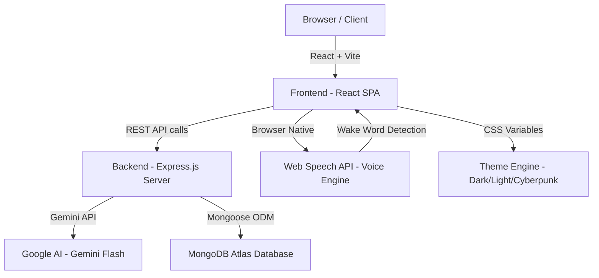

# 🚀 Dhyey's MERN Portfolio — Complete Technical Guide

> Use this document to explain your portfolio's code, architecture, and technologies to **recruiters, interviewers, or anyone** who asks.

---

## 🏗️ Architecture Overview



---

## 📦 Tech Stack Breakdown

| Layer | Technology | Why You Chose It |
|---|---|---|
| **Frontend Framework** | React 18 + TypeScript | Component-based UI with type safety |
| **Build Tool** | Vite | 10x faster than Webpack, instant HMR |
| **Animations** | Framer Motion | Production-grade React animation library |
| **3D Graphics** | Three.js / React Three Fiber | Particle background effects |
| **Backend** | Node.js + Express.js | Lightweight, non-blocking REST API server |
| **Database** | MongoDB Atlas + Mongoose | NoSQL document store, perfect for flexible data |
| **AI Engine** | Google Gemini Flash API | Streaming generative AI responses |
| **Voice Engine** | Web Speech API (Browser Native) | Free, no API cost, works offline for STT |
| **Styling** | Vanilla CSS + CSS Variables | Full control over theming with zero dependencies |
| **Deployment** | Docker + Docker Compose | Containerized for consistent deployment |
| **Notifications** | React Hot Toast | Elegant toast notifications |
| **SEO** | React Helmet Async | Dynamic meta tags for each page |

---

## 🎙️ "Hey DJ" Voice AI System — How It Works

This is the **#1 most impressive feature** of your portfolio. Here's exactly how to explain it:

### The 3-Layer Voice Architecture

```
Layer 1: Wake Word Detector (Always Running)
   ↓ Hears "Hey DJ"
Layer 2: Instant Command Interceptor (Client-Side)
   ↓ If no match found
Layer 3: Gemini AI Backend (Server-Side Streaming)
```

### Layer 1: Wake Word Detection
**File:** `ChatbotWidget.tsx` (lines 26-111)

**How to explain it:**
> "I use the browser's native `SpeechRecognition` API in `continuous` mode. It's always passively listening in the background. When it detects the phrase 'DJ' or 'Hey DJ' in the transcript, it activates the command listener. Think of it exactly like how Alexa listens for 'Alexa' — same concept, but built entirely with browser APIs, zero cost."

**Key Code Concept:**
```typescript
const recognizer = new SpeechRecognition();
recognizer.continuous = true;  // Never stops listening
recognizer.onresult = (event) => {
  const phrase = event.results[...].transcript.toLowerCase();
  if (phrase.includes('dj')) {
    // WAKE WORD DETECTED → Activate command mode
    commandLockRef.current = true;
  }
};
```

### Layer 2: Instant Voice Navigation (Client-Side Interceptor)
**File:** `ChatbotWidget.tsx` (lines 68-97)

**How to explain it:**
> "Before sending anything to the AI server, I first check if the voice command matches a known navigation phrase using a simple hashmap lookup. Commands like 'show resume' or 'cyberpunk mode' execute instantly on the client with zero network latency. Only unrecognized commands fall through to the Gemini API."

**Key Code Concept:**
```typescript
const navMap = {
  'show resume': 'resume',
  'show projects': 'portfolio',
  'cyberpunk mode': 'cyberpunk',
  // ... 20+ mapped phrases
};
const target = navMap[voiceInput];
if (target) {
  setActivePage(target);  // Instant! No API call needed
  speakText("Taking you there now.", true);
} else {
  handleSend(voiceInput, true);  // Falls through to Gemini
}
```

### Layer 3: Gemini AI Streaming Backend
**File:** `server/index.js` (lines 63-180)

**How to explain it:**
> "I use Google's Gemini Flash model with Server-Sent Events (SSE) streaming. Instead of waiting for the entire AI response to generate, I stream each chunk of text to the browser in real-time using SSE. This creates a 'typing' effect similar to ChatGPT. The system prompt contains all of Dhyey's professional information, making DJ a domain-specific AI agent."

**Key Code Concept:**
```javascript
// SSE Streaming
res.setHeader('Content-Type', 'text/event-stream');
for await (const chunk of result.stream) {
  const text = chunk.text();
  res.write(`data: ${JSON.stringify({ text })}\n\n`);
}
res.write('data: [DONE]\n\n');
```

---

## 🔄 Continuous Conversation Mode

**How to explain it:**
> "After DJ finishes speaking a response, I automatically re-open the microphone using the `onend` callback of the `SpeechSynthesisUtterance`. This creates a seamless conversation loop — the user doesn't need to click anything or say the wake word again. It's like having a real conversation. The loop continues until the user says 'stop' or 'goodbye'."

**Key Code Concept:**
```typescript
utterance.onend = () => {
  isSpeakingRef.current = false;
  if (keepListening) {
    commandLockRef.current = true;   // Re-arm the listener
    setIsListening(true);            // Mic glows green again
  }
};
```

---

## 🎨 Voice-Activated Theme Engine

**File:** `ChatbotWidget.tsx` + `App.tsx` + `index.css`

**How to explain it:**
> "My portfolio supports 3 CSS themes: Dark, Light, and Cyberpunk. Each theme is defined as a set of CSS custom properties (variables) on the `:root` selector using `data-theme` attributes. When DJ detects a `<THEME:cyberpunk>` command tag in the AI response, it calls `setTheme()` which mutates the `data-theme` attribute on the document root, instantly re-painting every element on the page."

**Key Code Concept:**
```css
/* In index.css */
:root[data-theme="cyberpunk"] {
  --bg-primary: #0a0a0f;
  --accent-color: #ff0055;
  --text-glow: 0 0 10px #00ffcc;
}
```
```typescript
// In ChatbotWidget.tsx — after AI response
const themeMatch = botReply.match(/<THEME:(dark|light|cyberpunk)>/i);
if (themeMatch) {
  setTheme(themeMatch[1]);  // Mutates CSS on document root
}
```

---

## 🛡️ Gemini Stability Engineering

### Problem 1: API Rate Limiting (HTTP 429)
**How to explain it:**
> "Google's Gemini API has strict rate limits. If a user spams the chat, the API returns a 429 error. I solved this with two mechanisms: (1) A client-side `isLoading` lock that prevents duplicate requests, and (2) A server-side interceptor that catches 429 errors and returns a friendly styled message instead of crashing."

### Problem 2: Conversation History Role Alternation
**How to explain it:**
> "Gemini requires strictly alternating `user` → `model` → `user` → `model` roles in conversation history. If two consecutive user messages are sent (which happens when the user sends a message while the AI is still responding), Gemini throws an error. I built a history compaction algorithm on the backend that automatically merges consecutive same-role messages before sending them to Gemini."

### Problem 3: Chrome Garbage Collection Bug
**How to explain it:**
> "Chrome has a known bug where it garbage-collects `SpeechSynthesisUtterance` objects during long operations, silently killing the voice mid-sentence. I solved this by anchoring the utterance to a `useRef` (`utteranceRef`), which prevents React's garbage collector from cleaning it up. I also send an empty utterance as a 'warm-up ping' before the API call to keep the audio context alive."

---

## 📁 Key File Map

| File | Purpose |
|---|---|
| `src/App.tsx` | Main app shell, routing, theme state, page switching |
| `src/components/ChatbotWidget.tsx` | The entire DJ Voice AI engine (wake word, navigation, TTS, STT) |
| `src/components/Sidebar.tsx` | Profile card with social links and contact info |
| `src/components/Background3D.tsx` | Three.js particle background animation |
| `src/components/CustomCursor.tsx` | Custom mouse cursor component |
| `src/pages/About.tsx` | About page content |
| `src/pages/Resume.tsx` | Resume/experience page |
| `src/pages/Portfolio.tsx` | Projects showcase with filtering |
| `src/pages/Contact.tsx` | Contact form with email integration |
| `src/pages/Admin.tsx` | Protected admin dashboard |
| `src/index.css` | All CSS themes (Dark, Light, Cyberpunk) + design system |
| `server/index.js` | Express backend — Gemini AI, MongoDB, SSE streaming |
| `Dockerfile` | Frontend container config |
| `server/Dockerfile` | Backend container config |
| `docker-compose.yml` | Multi-container orchestration |

---

## 🗣️ How to Explain This to a Recruiter (30-Second Pitch)

> "I built a full-stack MERN portfolio featuring a custom AI voice assistant called DJ. You say 'Hey DJ' and it wakes up — exactly like Alexa or Siri. It uses the browser's native Speech Recognition API for voice input, Google Gemini for intelligent responses streamed via SSE, and the Speech Synthesis API for voice output. I also built an instant client-side navigation interceptor — so commands like 'show resume' execute with zero latency without hitting the server. The entire site supports 3 CSS themes including a Cyberpunk mode, all switchable by voice. The backend runs on Express with MongoDB, and everything is containerized with Docker."

---

## 🗣️ How to Explain This to a Technical Interviewer (Deep Dive)

> "The voice system has 3 layers. Layer 1 is a persistent `SpeechRecognition` instance in continuous mode that acts as a wake-word detector. When it hears 'DJ', it flips a `commandLockRef` flag which redirects the next recognized phrase into the command pipeline instead of the wake-word matcher.
>
> Layer 2 is a client-side hashmap interceptor — it pattern-matches common navigation and theme commands instantly without any network call. This gives us sub-100ms response times for navigation.
>
> Layer 3 is the Gemini Flash model on the backend. I stream responses using SSE with `text/event-stream` content type. Each chunk gets parsed on the frontend and appended to the chat bubble in real-time. After streaming completes, I run regex matchers to extract `<NAVIGATE:page>` and `<THEME:mode>` command tags that the AI was instructed to embed in its responses.
>
> The biggest technical challenges were: Chrome's GC bug silently killing TTS utterances (solved with useRef anchoring), Gemini's strict role-alternation requirement (solved with a server-side history compaction algorithm), and maintaining continuous conversation flow (solved by re-arming the microphone in the utterance's `onend` callback)."
